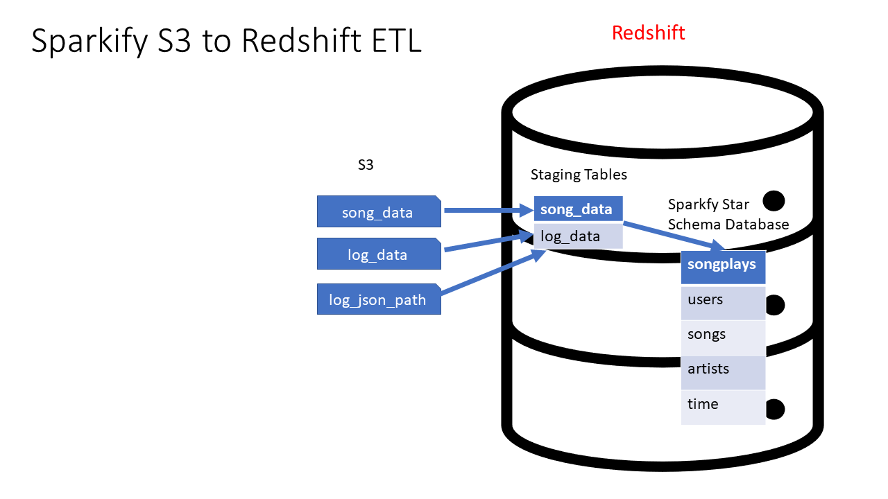

# Data Warehouse with Redshift

This project builds a data warehouse in Amazon Redshift for a music streaming company. ETL processes are written in Python, using SQL queries to perform data modeling.

## Project Structure

- `dwh.cfg`: Configuration file that contains information about AWS, IAM roles, and S3 data sources.
- `sql_queries.py`: Contains SQL queries for drop, create, insert and copy operations on the database.
- `create_tables.py`: Python script to drop existing tables and create new tables.
- `etl.py`: Python script to extract JSON data from S3, stages it into Redshift, and then transforms the data into fact and dimension tables.

## Files and their function

1. `dwh.cfg`: Contains all the necessary configurations needed to connect to AWS services and run the SQL queries.
2. `create_tables.py`: Contains the function to connect to the Redshift cluster and run the create and drop table queries.
3. `sql_queries.py`: Contains all the SQL queries to create, drop, copy and insert data into the tables.
4. `etl.py`: Reads and loads the staging tables from S3 buckets, transforms the data into dimensional and fact tables and loads them into Redshift cluster.

## How to run

1. Fill in all the necessary details in `dwh.cfg` like AWS_ACCESS_KEY_ID, AWS_SECRET_ACCESS_KEY, DB_NAME, DB_USER, DB_PASSWORD, DB_PORT etc.
2. Run `create_tables.py` to create the necessary tables.
3. Run `etl.py` to load data from S3 into staging tables and then into analytics tables.

# Outline of Tasks:

## 1. Set Up the Environment:
- **Launch a Redshift cluster.**
- **Create an IAM role with read access to S3.**
- **Update the configuration file (dwh.cfg) with Redshift database and IAM role information.**

## 2. Create Table Schemas:
- **Design schemas for fact and dimension tables.**
- **Write SQL statements to create these tables.**
- **Implement the logic in the `create_tables.py` script to connect to the database and set up these tables.**

## 3. ETL Pipeline Development:
- **Extract data from S3.**
- **Stage the extracted data in Redshift.**
- **Transform and load the data from the staging tables to the analytics tables in Redshift.**

## 4. Testing:
- **Run the `create_tables.py` script to ensure the tables are set up correctly.**
- **Execute the ETL pipeline by running the `etl.py` script.**
- **Run analytic queries on Redshift to validate the data.**

## 5. Clean Up:
- **Delete the Redshift cluster to avoid incurring unnecessary costs.**

## 6. Documentation:
- **Write a comprehensive `README.md` detailing the process, decisions made, and any challenges faced during the project.**

